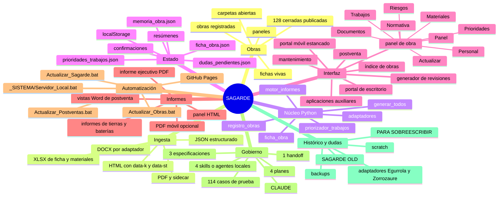
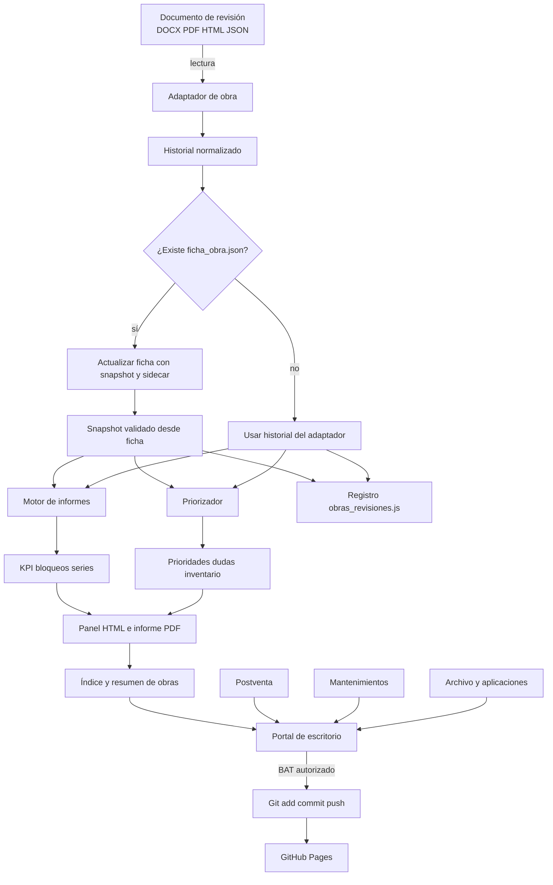
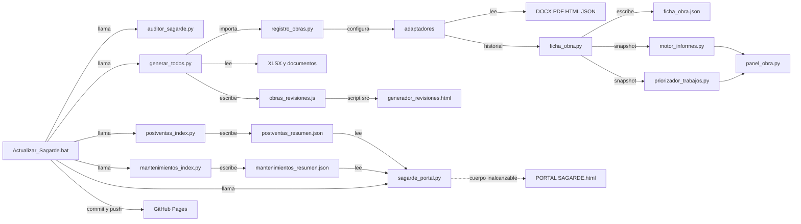
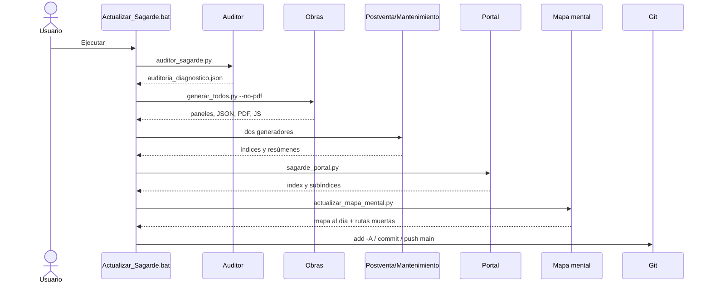

# 1. Título y metadatos

## Auditoría documental y mapa mental del entorno SAGARDE

> **LECTURA OBLIGATORIA AL EMPEZAR SESIÓN.** Este documento dice dónde vive
> cada cosa del entorno: obras y sus bases de datos, skills, scripts,
> aplicaciones, adaptadores, catálogo de tajos, generador de revisiones,
> portal y BAT de publicación. Antes de buscar un fichero a ciegas o de
> preguntar dónde está algo, mirarlo aquí.
>
> **Y se actualiza cuando cambia el entorno, no cuando alguien se acuerda.**
> Si una sesión añade una obra, una skill, un script o un tipo de fichero
> nuevo, esa misma sesión lo refleja aquí.

**Última actualización: 12/08/2026** — Prioridades pasó a leer la base de cada
obra; el catálogo de tajos declara la cadena de obra completa. Ver §2 y el
ciclo del dato.

## Estado de hoy

Las dos tablas que siguen las reescribe
`_SISTEMA/MOTOR/scripts/actualizar_mapa_mental.py` en cada
`Actualizar_Sagarde.bat`. **Todo lo demás de este documento está escrito a
mano y ningún script lo toca**: un generador que rehiciera la prosa borraría
el criterio de quien la escribió.

<!-- AUTO:estado -->
*Lo reescribe `_SISTEMA/MOTOR/scripts/actualizar_mapa_mental.py` en cada `Actualizar_Sagarde.bat`. La fecha es la de la última vez que alguna cifra cambió: 14/08/2026 01:59. No editar a mano.*

**21** carpetas de obra abiertas · **5** en el registro único · **5** con panel · **4** con ficha. En todo el árbol, **73** `.py` y **4** `.bat`.

| Obra | Ubic. | Tajos | Celdas | X | M | / | P | ? | N | % |
|---|---|---|---|---|---|---|---|---|---|---|
| 2025 GERNIKA 32V | 32 | 38 | 1216 | 928 | – | – | 288 | – | – | 76.3 |
| 2026 BOLUETA ACR | 97 | 38 | 3686 | 1453 | 103 | 19 | 1921 | 190 | – | 43.5 |
| 2026 MUNGIA ACR NEINOR | 62 | 38 | 2356 | 1810 | 82 | – | 429 | 35 | – | 80.1 |
| 2026 OBRA PRUEBA | 31 | 38 | 1178 | 70 | 6 | 5 | 1097 | – | – | 6.4 |

`X` terminado · `M` mas del 50 % · `/` iniciado · `P` pendiente confirmado · `?` sin mirar · `N` no aplica.
<!-- /AUTO:estado -->

### Salud del propio documento

El mapa envejece por las rutas: el 08/08/2026 el motor bajó a
`_SISTEMA/MOTOR/` y el documento siguió diciendo `_MOTOR_SAGARDE/` **23 veces**
hasta el 12/08, mandando a ciegas a quien lo leía al empezar sesión. Desde
entonces cada publicación comprueba una por una las rutas que este documento
declara y publica aquí las que no llevan a ninguna parte.

<!-- AUTO:rutas_muertas -->
*Se comprueban en cada `Actualizar_Sagarde.bat`. Ninguna ruta declarada en este documento apunta a un sitio que no exista (última variación: 14/08/2026 01:59).*
<!-- /AUTO:rutas_muertas -->

| Campo | Valor |
|---|---|
| Fecha de análisis | 29/07/2026 (auditoría original) · revisado 12/08/2026 |
| Raíz analizada | `D:\Nueva carpeta\OneDrive\COPIA SEGURIDAD SAGARDE` |
| Alcance | Árbol local completo actualizado: 2.199 directorios y 27.139 archivos fuera de `.git`; también se inspeccionaron configuración y hooks de `.git` sin alterar el repositorio. |
| Carpetas raíz examinadas | **11** fuera de `.git` (12/08/2026): `.agents`, `.claude`, `.gemini`, `.superpowers`, `APLICACIONES`, `MANTENIMIENTOS`, `POST-VENTAS`, `SAGARDE (OLD)`, `SAGARDE OBRAS ABIERTAS`, `VARIOS`, `_SISTEMA`. *(La auditoría del 29/07 examinó 14: `docs`, `scratch` y `_MOTOR_SAGARDE` bajaron a `_SISTEMA/` con la norma del 08/08, y `PARA SOBREESCRIBIR` se borró por vacía.)* |
| Limitaciones | No se ejecutaron generadores de obra/informe, BAT de publicación ni lectores que escriben datos. Sí se ejecutaron el sincronizador multi-IA y el validador estructural de skills. `git` no está disponible, por lo que no se pudo obtener `git status`. No existe manifiesto general de dependencias. Los binarios se inventariaron y contrastaron con el código que los consume; no se atribuye contenido no demostrable. |
| Criterio de validación | Prioridad: código ejecutable y datos actuales → configuración → salida generada coherente → documentación. Un plan, handoff o comentario aislado no confirma comportamiento actual. |

> **Abreviatura de rutas:** en las tablas, `_SISTEMA...` equivale exactamente a `SAGARDE OBRAS ABIERTAS/_SISTEMA INFORME SAGARDE IA`; no representa una carpeta diferente.

> **Zona personal (10/08/2026):** al publicar este documento en el repositorio
> —que es público— se sustituyeron 11 rutas de `VARIOS/APPS SAGARDE/…` por
> `[zona personal, excluida del repositorio]`. Los datos de esa zona (vida
> laboral, convenio, nóminas) nunca han estado en git: los excluye el
> `.gitignore`. Lo que se retira aquí son los nombres de esos ficheros, no su
> contenido. En disco siguen donde estaban y el mapa sigue diciendo que la
> zona existe y que es sensible.

### Leyenda de certeza

- **CONFIRMADO POR CÓDIGO**: implementación ejecutable y, cuando procede, salida actual encontrada.
- **CONFIRMADO POR CONFIGURACIÓN**: clave o comando presente en configuración.
- **CONFIRMADO POR DOCUMENTACIÓN**: descrito, pero no necesariamente implementado.
- **INFERIDO CON EVIDENCIA**: relación consistente, no expresada como llamada directa.
- **SIN USO CONFIRMADO**: archivo existente sin importación, llamada ni registro vigente.
- **APARENTEMENTE OBSOLETO**: contradice la implementación actual o está identificado como antiguo.
- **PENDIENTE DE VERIFICAR / SIN EVIDENCIA SUFICIENTE**: el árbol no permite resolverlo.

# 2. Resumen ejecutivo

SAGARDE es actualmente un repositorio local, monousuario y basado en archivos para centralizar obras eléctricas y de telecomunicaciones, revisiones de campo, postventa, mantenimientos y herramientas auxiliares. No es una aplicación cliente-servidor ni contiene una base de datos convencional: el núcleo es Python, las entradas principales son DOCX/PDF/HTML/JSON/XLSX y las salidas son JSON, HTML y PDF. La interfaz se sirve como archivos estáticos, directamente o mediante `python -m http.server`. Evidencia: `CLAUDE.md`, `_SISTEMA/MOTOR/CLAUDE.md`, `.claude/launch.json`, `Actualizar_Sagarde.bat`.

Las capas confirmadas son:

1. **Fuentes documentales**: las carpetas de obras abiertas (cuenta viva en «Estado de hoy»), 128 obras cerradas publicadas, 31 contratos de postventa y 4 contratos de mantenimiento en sus resúmenes actuales.
2. **Normalización**: siete adaptadores Python y lectores genéricos PDF/HTML/XLSX. Solo cinco adaptadores están registrados; dos apuntan a obras ya cerradas y sus rutas bajo obras abiertas no existen.
3. **Estado persistente**: un `ficha_obra.json` por obra registrada —la base de datos de cada obra—, sidecars, memorias, prioridades, dudas, confirmaciones y resúmenes. Gorliz está registrado pero sin revisión ni base.

   **Las cifras de cada base están en «Estado de hoy»**, al principio de este
   documento, con su desglose de estados. Aquí había una segunda copia de esa
   tabla escrita a mano; se retiró el 12/08/2026 porque dos tablas con los
   mismos datos acaban divergiendo, y la de aquí ya había llegado a decir tres
   fichas cuando eran cinco.

   Cada base es una **rejilla densa** `ubicaciones × tajos`, y cada celda guarda `{v: estado, f: fecha, r: revisión}`. Los estados son `X` terminado, `M` mínimo 50 %, `/` empezado, `P` pendiente confirmado, `?` nadie lo ha mirado, `N` no aplica.
4. **Cálculo y decisión**: `motor_informes.py`, `priorizador_trabajos.py`, un catálogo de 39 tajos comunes (+18 propios de Orueta) y reglas específicas de obra. **La base es el estado; el catálogo es la regla.** La base dice qué existe y cómo está; el catálogo dice en qué orden va cada tajo y qué exige qué.

   **La cadena de obra está declarada** (12/08/2026): 47 dependencias, y solo
   4 tajos sin ninguna, los cuatro a propósito —`Tabicado` porque es el
   primero de la obra; `Techos de zonas comunes` y `Fachada terminada` porque
   llegan cuando el plan de la constructora los programa; y `Cuarto técnico`
   porque son los recintos de instalaciones (RITI, RITS, RITU, centralización
   de contadores) y *"cuando proceda se realizan y punto"*. La secuencia
   completa está dibujada en `reglas/CRITERIOS_PRIORIZACION_TRABAJOS.md`.

   La evidencia de esa cadena es `2026 MUNGIA ACR NEINOR/COCOPLAN/`: los
   planes **Last Planner System** de la constructora, con 71 actividades
   fechadas y su gremio, más planes semanales, restricciones e indicadores.
   Cocoplan cubre la obra entera y todos los gremios; nosotros solo modelamos
   lo que nos condiciona la entrada, y agrupa varios tajos eléctricos en uno
   solo, así que sus nombres **no mapean uno a uno** con los nuestros.

   **Al añadir un tajo al catálogo hay que preguntar qué debe estar terminado
   antes.** Un tajo sin dependencia sale siempre viable, que es tan falso como
   salir siempre bloqueado.
5. **Presentación**: un panel por obra registrada (cuenta viva en «Estado de hoy»), índices, portal de escritorio, un portal móvil estancado, generador de revisiones y siete accesos de aplicaciones.
6. **Orquestación/publicación**: `generar_todos.py`, `sagarde_portal.py`, scripts especializados y cuatro BAT. `Actualizar_Sagarde.bat` termina en `git add -A`, commit y `push origin main`.
7. **Gobierno**: dos `CLAUDE.md`, cuatro definiciones locales tipo skill/agente, planes, especificaciones, handoffs, memoria vigente y 114 casos de prueba definidos estáticamente.

Flujo confirmado: una revisión DOCX/PDF/HTML/JSON se lee mediante un adaptador; se normaliza a `task/floor/building/unit/status`; si existe ficha, la revisión la actualiza y la ficha vuelve a producir el snapshot validado; el motor calcula KPI y bloqueos; **el priorizador lee la base de la obra** y produce trabajos, previsión y preguntas; se escriben memoria, panel e informe ejecutivo; después se agregan índices, el registro del generador y el portal.

## Ciclo completo del dato (12/08/2026)

```
reglas/CATALOGO_TAJOS.json ──┐
                             ├→ generar_todos.py → obras_revisiones.js
<obra>/…/ficha_obra.json ────┘                            ↓
        ↑                                    generador_revisiones.html
        │                                                 ↓
        │                                            hoja A4 PDF
        │                                                 ↓ boli en obra
        └──── leer_hoja_marcada.py ←──────────────── escaneo
                      ↓
              priorizador_trabajos.py → prioridades_trabajos.json → panel
```

Dos hechos que conviene tener presentes al tocar cualquier eslabón:

- **El generador consume la salida del priorizador, no el catálogo directamente.** `crear_registro_revision(obra, prioridades)` construye la lista de tajos de la hoja desde `detalle_items`. Cambiar el priorizador cambia la hoja impresa.
- **`reglas/CATALOGO_TAJOS.json` no está en git.** La línea 2 del `.gitignore` (`*`) lo atrapa y no se le hizo excepción. Es una decisión tomada el 11/08/2026: su única copia es el historial de versiones de OneDrive. **No mutarlo para una prueba: no hay `git checkout` que lo restaure.**

Lo más consolidado es el camino de cinco obras registradas, el contrato común de estados y las salidas JSON/HTML. Las dudas principales son: 16 carpetas abiertas sin automatización; dos adaptadores huérfanos; Gorliz sin revisión ni base; documentación antigua; una skill de alta desactualizada; portal móvil no reescrito por código inalcanzable; índice de mantenimiento con dos generadores; dependencias sin manifiesto; y cientos de backups sin política ejecutable de vigencia.

Pendientes concretos al cierre del 13/08/2026:

- **Orueta está cerrada** (13/08/2026). Se archivó con `cerrar_obra.py`:
  su carpeta está en `SAGARDE (OLD)/OBRAS CERRADAS`, con su adaptador y la
  prueba del adaptador dentro de su `_SISTEMA`, y un `cierre.json` que guarda
  cómo terminó (99.7 %, 102 ubicaciones, 4080 celdas, `X=2314 P=8 N=1758`).
  Sus 18 tajos propios **siguen en el catálogo**: no se tocan. Su duplicado
  `placas_tapas` / `placas_tps_cuadro` era el mismo tajo escrito de dos formas
  y se quedó así.
- **Cerrarla dejó 4 pruebas sin ejecutarse**: 3 de
  `test_tajos_propios_de_obra.py` y una de paginación. Se saltan con motivo
  visible, pero los tajos propios de obra se quedan sin ninguna obra que los
  ejercite. Habría que apoyarlos en OBRA PRUEBA o en un fixture.
- Sigue abierto de antes: 16 carpetas de obra sin automatización, dos
  adaptadores huérfanos, Gorliz sin revisión ni base, una skill de alta
  desactualizada, el portal móvil, el índice de mantenimiento con dos
  generadores, y las dependencias sin manifiesto.

# 3. Mapa mental principal





# 4. Arquitectura por capas

| ID | Capa | Subcapa | Componente | Tipo | Ruta | Función | Entrada | Salida | Depende de | Utilizado por | Estado | Evidencia |
|---|---|---|---|---|---|---|---|---|---|---|---|---|
| A01 | Gobierno | Instrucciones | Instrucciones raíz | configuración | `CLAUDE.md` | Reglas globales, estados y continuidad | Sesión | Criterios | Árbol | Agentes | Operativo documental | `CLAUDE.md:1`, `:73-85`, `:195` |
| A02 | Gobierno | Motor | Instrucciones motor | configuración | `_SISTEMA/MOTOR/CLAUDE.md` | Pipeline, comandos, rutas y skills | Tarea | Protocolo | Código | Agentes | Operativo documental | `_SISTEMA/MOTOR/CLAUDE.md:8-41` |
| A03 | Entrada | Obras | Documentación de obra | almacenamiento | `SAGARDE OBRAS ABIERTAS/*` | Revisión, ficha, materiales y planos | Archivos | Datos brutos | OneDrive | Adaptadores | carpetas y automatizadas: ver «Estado de hoy» | `registro_obras.py:10-72`, `resumen_obras.json` |
| A04 | Entrada | Postventa | Contratos/incidencias | almacenamiento | `POST-VENTAS/INCIDENCIAS*` | PDF, Word, fotos e histórico | Documentos | Índice/resumen | python-docx | `postventas_index.py` | Operativo | `postventas_index.py:90-126` |
| A05 | Entrada | Mantenimiento | Contratos | almacenamiento | `MANTENIMIENTOS/MANTENIMIENTO *` | Archivo por contrato | Documentos | Índice/mapas/resumen | filesystem | Dos generadores | Con duplicidad | `mantenimientos_index.py:82-143`; `sagarde_portal.py:147-183` |
| A06 | Normalización | Registro | `OBRAS` | configuración | `registro_obras.py` | Registro único de 5 obras | Nombre/alias | Config resuelta | — | Generadores | Operativo | `registro_obras.py:2-5`, `:10-72` |
| A07 | Normalización | Adaptadores | 7 adaptadores | módulo | `_SISTEMA.../adaptadores/*.py` | Traducción a esquema común | DOCX/PDF/HTML/JSON | Historial | lectores | Orquestador | 5 activos; 2 sin uso | `generar_todos.py:820-835`; registro |
| A08 | Normalización | Lectores | Lectores genéricos | módulo | `lectores.py`, `lector_hoja_tajos_pdf.py`, `lector_hoja_tajos_html.py` | Leer XLSX/PDF/HTML | Archivos | Registros | openpyxl/pdfplumber | Adaptadores | Operativo | funciones `leer_*`, `parsear_*` |
| A09 | Persistencia | Ficha viva | `ficha_obra.py` | módulo | `_SISTEMA.../ficha_obra.py` | Estructura/estados acumulativos | Snapshot/sidecar | ficha y snapshot | catálogo | orquestador | Operativo en 3 obras | `ficha_obra.py:33-44`, `:368-416` |
| A10 | Persistencia | Corrección | Sidecar PDF | almacenamiento | `*.pdf.correcciones.json` | Fijar marcas, incluido blanco | Clave/estado | Corrección | lector PDF | adaptador/ficha | Operativo | `lector_hoja_tajos_pdf.py:46-66` |
| A11 | Cálculo | KPI | Motor común | módulo | `motor_informes.py` | KPI, cobertura, bloqueos, series | Historial | Métricas | esquema común | Panel/informe | Operativo | `motor_informes.py:37-220` |
| A12 | Decisión | Catálogo | Catálogo tajos | configuración | `reglas/CATALOGO_TAJOS.json` | IDs, alias, fases y dependencias | Tajo/obra | Metadatos | JSON | Priorizador/ficha | Operativo v1.3 | `priorizador_trabajos.py:76-134` |
| A13 | Decisión | Prioridades | Priorizador v4.3 | módulo | `priorizador_trabajos.py` | Clasificar y agrupar | Historial + catálogo | JSON | catálogo | Panel | Operativo | `priorizador_trabajos.py:14-36`, `:560-633` |
| A14 | Orquestación | Obras | Generador total | script | `generar_todos.py` | Coordinar 5 obras y agregados | Registro/fuentes | JSON/HTML/PDF/JS | A06-A13 | BAT | Operativo | `generar_todos.py:800-978` |
| A15 | Presentación | Obra | Panel de obra | interfaz | `panel_obra.py` → `*/panel.html` | Nueve vistas | Snapshot/ficha | HTML | Chart.js local | Portal | 5 instancias | `panel_obra.py:476-538` |
| A16 | Presentación | Revisión | Generador | interfaz | `generador_revisiones.html` | Hojas desde fichas | JS/usuario | HTML/localStorage | navegador | Campo | Solo 3 fichas | `worksWithDatabase`, `sc-home`, `sc-wizard` |
| A17 | Presentación | Portal | Portal escritorio | interfaz | `sagarde_portal.py` → `index.html` | Centro de mando | Resúmenes/árbol | HTML | otras capas | Usuario | Operativo | `sagarde_portal.py:936-1085` |
| A18 | Presentación | Móvil | 5 pestañas | interfaz | `PORTAL SAGARDE.html` | Portal compacto | Resúmenes | HTML | `generar_portal_movil` | Usuario | APARENTEMENTE OBSOLETO | archivo 25/07; código `:569-759` |
| A19 | Presentación | Postventa | Índice/previews | interfaz | `postventas_index.py` | Filtros, pendientes, Word | Carpetas | HTML/JSON | python-docx | Portal | Operativo | `postventas_index.py:345-765` |
| A20 | Presentación | Mantenimiento | Índice/mapas | interfaz | dos Python | Resumen/árbol | Carpetas | HTML/JSON | filesystem | Portal | Duplicado | BAT + `sagarde_portal.main` |
| A21 | Presentación | Apps | 7 herramientas | interfaz | `APLICACIONES/index.html`, `VARIOS/*` | Tierras, baterías, personal | Datos locales | HTML/JSON/PDF | navegador | Portal | Mixto | `sagarde_portal.py:519-565`, `:853-887` |
| A22 | Informes | Ejecutivo eléctrico | PDF A4 | script | `generar_informe_ejecutivo.py` | Producción propia Sagarde por obra/portal | Ficha + historial + prioridades | PDF | ReportLab + catálogo + **fuentes en `assets/fonts/`** | Orquestador | Operativo desde base viva; tipografía propia desde 14/08/2026 | `generar_informe_ejecutivo.py` |
| A23 | Automatización | Global | Actualizador | automatización | `Actualizar_Sagarde.bat` | Regenerar y publicar | Árbol | Archivos/commit | Python/Git | Usuario | Riesgoso | BAT completo |
| A24 | Calidad | Pruebas | unittest | prueba | dos carpetas `tests` | 114 casos | Código/fixtures | Resultado | dependencias | Desarrollo | No ejecutado aquí | clases `Test*` |
| A25 | Histórico | Archivo | OLD/backups/scratch | almacenamiento | `SAGARDE (OLD)`, `*.bak`, `scratch` | Conservación/restos | Archivos | Consulta | — | Humano/portal | Histórico/duplicado | 128 cerradas; 590 nombres backup |

# 5. Inventario completo de componentes

## 5.1 Skills

Desde el 29/07/2026 existe una Agent Skill canónica CARDIVA con `SKILL.md`.
Se mantiene en `APP_CARDIVA` y se replica de forma verificable en las carpetas
de descubrimiento de Codex, Claude y Gemini. Los cuatro archivos históricos de
`.claude/agents` continúan siendo agentes/protocolos locales y no deben
confundirse con la nueva skill.

| Skill | Ruta | Finalidad | Cómo se invoca | Entradas | Salidas | Scripts relacionados | Documentos relacionados | Referencias encontradas | Estado |
|---|---|---|---|---|---|---|---|---|---|
| `sagarde-actualizar` | `_SISTEMA/MOTOR/.claude/agents/sagarde-actualizar.md` | Actualización en 4 niveles | `/sagarde-actualizar` en `_SISTEMA/MOTOR/CLAUDE.md:12`; comandos Python en el archivo | Obra/alcance/autorización | Ficha, agregados o publicación | `regenerar_obra.py`, `generar_todos.py`, BAT global | `CLAUDE.md` | 1 llamada nominal | Propia; CONFIRMADO POR DOCUMENTACIÓN |
| `sagarde-revision` | `_SISTEMA/MOTOR/.claude/agents/sagarde-revision.md` | PDF de campo → sidecar → revisión oficial → memoria/generador | `/sagarde-revision`; también `sagarde-revision` en `CLAUDE.md:195` | Obra, fecha, PDF | PDF/sidecar/estado regenerado | validador, regenerador, orquestador | ambos `CLAUDE.md` | 2 formas nominales | Propia; coherente con código |
| `sagarde-nueva-obra` | `_SISTEMA/MOTOR/.claude/agents/sagarde-nueva-obra.md` | Crear entorno de obra | `/sagarde-nueva-obra` | Nombre, ID, estructura, materiales | Adaptador, JSON, panel | `generar_todos.py`, portal | motor `CLAUDE.md` | 1 llamada nominal | Propia; APARENTEMENTE OBSOLETA: registro/esquemas antiguos |
| `sagarde-parte-incidencia` | `.claude/agents/sagarde-parte-incidencia.md` | PDF postventa/preventivo/correctivo | No se halló sintaxis real | Datos/ruta | PDF | `generar_parte_incidencia.py` | memorias postventa | Ninguna llamada | Propia; SIN USO CONFIRMADO |
| `sagarde-cerrar-obra` | `.claude/skills/sagarde-cerrar-obra/SKILL.md` | Cerrar una obra y archivarla dejando el entorno limpio | `/sagarde-cerrar-obra`, o al decir que una obra ha terminado | id de la obra y confirmación de Bixente | obra fuera del registro y archivada con su `cierre.json` | `cerrar_obra.py` | esta especificación y su plan | Creada el 13/08/2026 | Activa; 21 pruebas |
| `generate-cardiva-report` | `MANTENIMIENTOS/MANTENIMIENTO CARDIVA/APP_CARDIVA/skills/generate-cardiva-report` | Extraer puntos 01–06, derivar 07–09 y generar el preventivo CARDIVA | Codex: `$generate-cardiva-report`; Claude: `/generate-cardiva-report`; Gemini: activación por descripción y control con `/skills` | Plantilla y partes expresamente autorizados o JSON normalizado | DOCX/PDF A4 y anexos fotográficos | `generate_cardiva_report.ps1`, `render_docx_pages.ps1`, `sync_cardiva_skill_agents.ps1` | `APP_CARDIVA/README.md`, `docs/SAGARDE_ENTORNO_IA_Y_SKILLS.md` | Fuente maestra y seis copias verificables | Activa; Agent Skill multi-IA |
| `superpowers:*` | Menciones en `CLAUDE.md`, planes y `.superpowers/sdd` | Flujos generales de agente | `using-superpowers`, `brainstorming`, `writing-plans`, `subagent-driven-development`, `systematic-debugging`, `verification-before-completion`, `requesting-code-review`, `dispatching-parallel-agents`, `executing-plans` | Tareas de desarrollo | Planes/revisiones | Ninguno demostrado | docs/ledgers | Menciones | Referencias externas; no instaladas en repo |
| `artifact-design` | `.claude/settings.local.json` | Capacidad general | `Skill(artifact-design)` | NO CONFIRMADO | NO CONFIRMADO | — | settings | 1 permiso | Referencia; instalación NO CONFIRMADA |

## 5.2 Scripts

Criterio: **49 archivos Python/BAT** (45 `.py`, incluidos pruebas y `__init__.py`, más 4 `.bat`). Se añaden dos JS clasificados aparte: dato generado y dependencia vendor.

> **Este inventario está incompleto y la cifra de arriba no vale (12/08/2026).**
> La cuenta real de `.py` y `.bat` del árbol está en «Estado de hoy», al
> principio del documento, y se recalcula en cada publicación. Faltan por
> listar aquí al menos los scripts del lector de hojas marcadas (paso 4 del
> ciclo, agosto) y las copias de la skill CARDIVA: la tabla pide una pasada
> completa que no se ha hecho.

| Script | Ruta | Lenguaje | Función | Ejecución | Llamado desde | Lee | Escribe / genera | Dependencias | Estado |
|---|---|---|---|---|---|---|---|---|---|
| `avisos.py` | `_SISTEMA/MOTOR/avisos.py` | Python | Antigüedad/caducidad 400 días | import | portal/auditor/mantenimiento/tests | timestamps | — | stdlib | Activo |
| `sagarde_portal.py` | `_SISTEMA/MOTOR/sagarde_portal.py` | Python | Portal, apps, cerradas, mapas | directo/BAT | BAT global | resúmenes/árbol | índices y mapas HTML | stdlib, avisos | Activo; móvil roto |
| `auditor_sagarde.py` | `_SISTEMA/MOTOR/scripts/auditor_sagarde.py` | Python | Auditoría pre-vuelo | directo/import | BAT/test | obras/mantenimiento | `auditoria_diagnostico.json` | stdlib | Activo; falsos duplicados |
| `cerrar_obra.py` | `_SISTEMA.../cerrar_obra.py` | Python | Cierra una obra: la saca del registro por AST, archiva su adaptador dentro de ella, mueve la carpeta a Obras cerradas y escribe `cierre.json` | `<id>` informa; `--ejecutar` lo hace | skill `sagarde-cerrar-obra` | registro, ficha, resumen | registro, carpeta movida, `cierre.json` | stdlib | Activo desde 13/08/2026 |
| `test_cerrar_obra.py` | `_SISTEMA.../tests/test_cerrar_obra.py` | Python | 21 casos sobre árbol temporal; 3 guardas comprobadas por mutación | unittest | manual | cerrar_obra | resultado | unittest | En verde el 13/08/2026 |
| `actualizar_mapa_mental.py` | `_SISTEMA/MOTOR/scripts/actualizar_mapa_mental.py` | Python | Reescribe los bloques `AUTO:` de este mapa y audita las rutas que declara | directo o BAT; `--comprobar` no escribe | BAT global, paso 4/5 | este mapa, fichas, `resumen_obras.json` | este mapa | stdlib | Activo desde 12/08/2026 |
| `generar_informe_ejecutivo.py` | `_SISTEMA/MOTOR/scripts/generar_informe_ejecutivo.py` | Python | PDF A4 eléctrico | `--obra`/import | orquestador | ficha/historial/prioridades + `assets/fonts/*.ttf` | PDF por obra y portal | ReportLab/catálogo | Activo; solo tajos propios Sagarde. Desde 14/08/2026 usa IBM Plex Sans y **falla si falta la fuente o el logo**, en vez de degradarse en silencio |
| `test_informe_ejecutivo_caracter.py` | `_SISTEMA.../tests` | Python | 21 casos: activos publicados, registro de fuente, tipografía dentro del PDF, regla de color y logo | unittest | manual | informe/`.gitignore`/logo | resultado | unittest, pdfplumber, PIL | En verde el 14/08/2026 |
| `generar_parte_incidencia.py` | `_SISTEMA/MOTOR/scripts/generar_parte_incidencia.py` | Python | Partes PDF | `--data --output`/import | skill parte | JSON/logo | PDF | ReportLab | Sin llamada real |
| `regenerar_obra.py` | `_SISTEMA/MOTOR/scripts/regenerar_obra.py` | Python | Obra aislada/agregados | `<id> [--finalizar]` | skills/planes | fuentes/caché | salidas/caché | motor | Activo; sin finalizar no publica JS |
| `validar_revision_pdf.py` | `_SISTEMA/MOTOR/scripts/validar_revision_pdf.py` | Python | Diagnóstico PDF | `<id> <pdf>` | skill revisión | PDF/adaptador | consola | lector PDF | Activo |
| `test_avisos.py` | `_SISTEMA/MOTOR/tests/test_avisos.py` | Python | 8 tests | unittest | manual | módulos | temporales de test | unittest | No ejecutado |
| `test_mapa_mental.py` | `_SISTEMA/MOTOR/tests/test_mapa_mental.py` | Python | 32 casos: extracción de rutas, bloques generados, estado de obras y trinquete sobre este mapa | unittest | manual | este mapa, actualizador | resultado | unittest | En verde el 12/08/2026 |
| `__init__.py` | `_SISTEMA/MOTOR/tests/__init__.py` | Python | Paquete tests | import | unittest | — | — | — | Estructural |
| `mantenimientos_index.py` | `MANTENIMIENTOS/_SISTEMA/mantenimientos_index.py` | Python | Índice/resumen | directo/BAT | BAT global | contratos | JSON + índice | avisos | Activo; índice sobrescrito después |
| `postventas_index.py` | `POST-VENTAS/_SISTEMA/postventas_index.py` | Python | Índice/previews/garantía | directo/BAT | 2 BAT | DOCX/PDF/fotos | índice/resumen/previews | python-docx | Activo |
| `postventas_sync.py` | `POST-VENTAS/_SISTEMA/postventas_sync.py` | Python | PDF→filas Word | CLI/dry-run | manual | PDF/DOCX | DOCX + backup | pdfplumber, python-docx | Manual y mutador |
| `claves_correcciones.py` | `_SISTEMA.../claves_correcciones.py` | Python | Normalizar claves | import | ficha/lector/tests | cadenas | — | stdlib | Activo |
| `ficha_obra.py` | `_SISTEMA.../ficha_obra.py` | Python | Ficha viva/snapshot | import | orquestador/tests | ficha/snapshot/catálogo | ficha/cambios | stdlib | Activo |
| `generar_todos.py` | `_SISTEMA.../generar_todos.py` | Python | Orquestador | `--no-pdf`, `--solo-revisiones` | BAT/skills | registro/fuentes | JSON/HTML/PDF/JS | internas, Playwright opcional | Activo |
| `lectores.py` | `_SISTEMA.../lectores.py` | Python | XLSX/documentos | import | orquestador | XLSX/árbol | dict/listas | openpyxl opcional | Activo |
| `lector_hoja_tajos_html.py` | `_SISTEMA.../lector_hoja_tajos_html.py` | Python | HTML `data-k/st` | import | Gernika | HTML | historial | stdlib | Activo |
| `lector_hoja_tajos_pdf.py` | `_SISTEMA.../lector_hoja_tajos_pdf.py` | Python | Tabla PDF/sidecar | import | 3 adaptadores/validador/tests | PDF/JSON | celdas/dudas | pdfplumber | Activo |
| `memoria_obra.py` | `_SISTEMA.../memoria_obra.py` | Python | Memoria histórica | import | orquestador | historial | `memoria_obra.json` | stdlib | Activo |
| `motor_informes.py` | `_SISTEMA.../motor_informes.py` | Python | KPI/bloqueos/series | import | panel/informe/tests | historial | métricas | stdlib | Activo |
| `panel_obra.py` | `_SISTEMA.../panel_obra.py` | Python | Panel 9 vistas | import | orquestador | métricas/ficha/docs | `panel.html` | Chart.js local | Activo |
| `priorizador_trabajos.py` | `_SISTEMA.../priorizador_trabajos.py` | Python | Prioridades v4.3 | import | orquestador/tests | historial/catálogo | prioridades/dudas | stdlib | Activo |
| `registro_obras.py` | `_SISTEMA.../registro_obras.py` | Python | Registro único | import | orquestador/informe/tests | lista interna | config resuelta | stdlib | Activo |
| `sembrar_ficha_obra.py` | `_SISTEMA.../sembrar_ficha_obra.py` | Python | Siembra hardcoded Mungia | directo | solo plan | confirmaciones/prioridades/sidecars | `ficha_obra_mungia.json` en sistema | internas | Histórico; no runtime |
| `adaptador_bolueta.py` | `_SISTEMA.../adaptadores` | Python | DOCX + PDF | import | registro | REVISIONES | historial | docx/lector PDF | Activo |
| `adaptador_egurrola.py` | idem | Python | 3 DOCX | directo/import potencial | ninguna referencia | ruta abierta inexistente | historial | docx | Huérfano; obra en OLD |
| `adaptador_gernika.py` | idem | Python | JSON + HTML | import | registro | IA/REVISIONES | historial | lector HTML | Activo |
| `adaptador_gorliz.py` | idem | Python | JSON estricto/vacío | import/directo | registro | IA JSON | historial/plantilla | stdlib | Activo sin revisión |
| `adaptador_mungia.py` | idem | Python | DOCX + PDF | import | registro | REVISIONES | historial | docx/lector PDF | Activo |
| `adaptador_obisporueta.py` | `SAGARDE (OLD)/OBRAS CERRADAS/2025 BILBAO OBISPO ORUETA/_SISTEMA/` | Python | DOCX + PDF especial | ya no se importa | — | REVISIONES SAGARDE | historial | docx/lector PDF | **Archivado con su obra el 13/08/2026**; no es un huérfano |
| `adaptador_zorrozaure.py` | idem | Python | 1 DOCX | directo/import potencial | ninguna referencia | ruta abierta inexistente | historial | docx | Huérfano; obra en OLD |
| `fixtures.py` | `_SISTEMA.../tests/fixtures.py` | Python | Fixtures | import | tests | parámetros | dicts | stdlib | Prueba |
| `test_adaptador_bolueta.py` | `_SISTEMA.../tests` | Python | 9 casos | unittest | manual | adaptador | resultado test | unittest | No ejecutado |
| `test_adaptador_obisporueta.py` | `SAGARDE (OLD)/OBRAS CERRADAS/2025 BILBAO OBISPO ORUETA/_SISTEMA/` | Python | 3 casos | unittest | — | adaptador | resultado | unittest | **Archivado con su adaptador el 13/08/2026**: se quedó atrás importando un módulo movido y tumbó la suite |
| `test_catalogo_tajos.py` | idem | Python | 9 casos | unittest | manual | catálogo/priorizador | resultado | unittest | No ejecutado |
| `test_ficha_obra.py` | idem | Python | 48 casos | unittest | manual | ficha/fixtures | resultado | unittest | No ejecutado |
| `test_generar_todos.py` | idem | Python | 17 casos | unittest | manual | generador/informe | temporales | unittest | No ejecutado |
| `test_lector_hoja_tajos_pdf.py` | idem | Python | 7 casos | unittest | manual | lector | resultado | unittest | No ejecutado |
| `test_motor_informes.py` | idem | Python | 9 casos | unittest | manual | motor | resultado | unittest | No ejecutado |
| `test_registro_obras.py` | idem | Python | 4 casos | unittest | manual | registro/generadores | resultado | unittest | No ejecutado |
| `generar_html.py` | `[zona personal, excluida del repositorio]` | Python | Dashboard laboral | directo | scripts personal | XLSX | HTML | openpyxl | Auxiliar activo |
| `actualizar_informe_nominas.py` | `[zona personal, excluida del repositorio]` | Python | Histórico nóminas | CLI | manual | HTML/datos | HTML; llama generador | subprocess | Auxiliar activo |
| `anadir_mes.py` | `[zona personal, excluida del repositorio]` | Python | CSV→mes Excel | directo | manual | CSV/XLSX | XLSX/HTML | openpyxl/subprocess | Auxiliar activo |
| `convertir_pdf.py` | `[zona personal, excluida del repositorio]` | Python | PDF→PNG mejorado | `<pdf> [destino]` | manual | PDF | PNG | PyMuPDF/Pillow | Auxiliar activo |
| `festivos.py` | `[zona personal, excluida del repositorio]` | Python | Festivos | import/directo | generador laboral | año/fecha | fechas | stdlib | Auxiliar activo |
| `Actualizar_Sagarde.bat` | raíz | BAT | Pipeline + publicación | doble clic/CLI | usuario | árbol | salidas + Git | Python/Git | Activo; alcance amplio |
| `Servidor_Local.bat` | `_SISTEMA` | BAT | HTTP LAN 8080 | doble clic | usuario | raíz (`%~dp0..`) | servidor | Python/ipconfig | Manual |
| `Actualizar_Postventas.bat` | `POST-VENTAS` | BAT | Regenerar/abrir postventa | doble clic | usuario | postventa | salidas | Python | Activo |
| `Actualizar_Obras.bat` | `_SISTEMA...` | BAT | Instalar y regenerar | doble clic/panel | usuario | obras | salidas | pip/Python | Activo; instala sin versiones |
| `obras_revisiones.js` | `_SISTEMA...` | JS generado | Datos para generador | `<script src>` | HTML generador | 4 obras | objeto `window` | navegador | Activo generado |
| `chart.min.js` | `_SISTEMA.../static` | JS vendor | Gráficos | `<script>` | paneles | series | canvas | Chart.js 4.4.7 | Dependencia |

## 5.3 Documentación, planes y handoffs

Hay 55 Markdown previos a esta auditoría. Se agrupan series repetitivas conservando el recuento.

| Documento | Ruta | Tipo | Finalidad | Vigencia aparente | Referenciado desde | Observaciones |
|---|---|---|---|---|---|---|
| Instrucciones raíz | `CLAUDE.md` | instrucciones | Reglas globales | Vigente | carga de proyecto | Coherente con ficha/riesgos |
| Instrucciones motor | `_SISTEMA/MOTOR/CLAUDE.md` | instrucciones | Pipeline/skills | Vigente con ruta ambigua | raíz/skills | `.claude/agents/...` depende del contexto |
| Memoria vigente | `docs/2026-07-28-memoria-diccionario-tajos-alertas-informes.md` | memoria | Estado y decisiones | Vigente declarada | `CLAUDE.md` | Continuidad principal |
| Guía de campo | `_SISTEMA/MOTOR/GUIA_CAMPO_MOBIL.md` | guía | Nomenclatura | Parcial | sin refs | Nombre real “MOBIL” |
| Hoja de ruta | `_SISTEMA/MOTOR/HOJA_DE_RUTA.md` | roadmap | Fases 1-4 | 1-3 completas; 4 en curso | sin ref directa | 16 obras sin automatizar |
| LEEME | `_SISTEMA.../LEEME.md` | documentación | Arquitectura antigua | APARENTEMENTE OBSOLETO | manual | M=75%, niega lector genérico/materiales; código dice otra cosa |
| PROCEDIMIENTO | `_SISTEMA.../PROCEDIMIENTO.md` | procedimiento | Alta por tiers | Histórico/parcial | manual | Lista obras cerradas y pasos antiguos |
| Criterios | `_SISTEMA.../reglas/CRITERIOS_PRIORIZACION_TRABAJOS.md` | reglas | Prioridad v4 | Parcial | por concepto | Contrastar con código v4.3 |
| Plan fase A | `docs/superpowers/plans/2026-07-27-fase-A-inversion-del-flujo.md` | plan | Ficha→motor | Implementado según código/reportes | ledger | Plan no es prueba única |
| Plan ficha viva | `docs/superpowers/plans/2026-07-27-ficha-obra-base-viva.md` | plan | Introducir ficha | Implementado en 3 obras | ledger | Comandos históricos |
| Plan generador | `docs/superpowers/plans/2026-07-28-generador-revisiones-desde-la-base.md` | plan | Generador desde ficha | Implementación hallada | spec | Checklist del plan persiste |
| Trabajo restante | `docs/superpowers/plans/2026-07-28-trabajo-restante-y-reparto.md` | plan | Bloques A-F | Histórico/parcialmente superado | handoff/memoria | Cifras anteriores |
| Handoff B | `docs/superpowers/plans/2026-07-28-bloque-b-handoff.md` | handoff | Continuidad | APARENTEMENTE OBSOLETO | memoria posterior | Cabecera declara que dejó de estar vigente |
| 3 diseños | `docs/superpowers/specs/*.md` | especificación | Base/ficha/generador | Diseño | planes | No confirma ejecución |
| SDD | `.superpowers/sdd/*` | artefactos | 2 ledgers, 10 briefs, 10 informes | Histórico | planes | 22 Markdown |
| Memoria postventa | `POST-VENTAS/_SISTEMA/.memory/*.md` | memoria | Reglas/casos/usuario/logo | Parcial | manual/código | 7; dos referencias de la skill no existen |
| Personal | `[zona personal, excluida del repositorio]` | instrucciones/datos | Vida laboral/convenio/nómina | Auxiliar activo | scripts | Datos sensibles; excluido de Git |
| Transcripción Gernika | `SAGARDE OBRAS ABIERTAS/2025 GERNIKA 32V/REVISIÓN/.../*.md` | fuente | Transcripción | Histórica | carpeta obra | No es código |

**Planificación localizada:** 4 planes, 1 handoff, 3 especificaciones y 2 ledgers de ejecución.

## 5.4 Configuraciones

| Archivo | Finalidad/opciones | Afecta a | Precedencia o riesgo |
|---|---|---|---|
| `.gitignore` | Whitelist de HTML, Python y JSON/documentos seleccionados; excluye personal, `.superpowers`, `.claude`, pyc/backups | Git/Pages | Árbol local mucho mayor que lo publicable; áreas genéricas pueden dar 404 |
| `.claudeignore` | Oculta paneles, OLD, previews, apps/históricos/backups | Herramienta Claude | No desactiva componentes |
| `.claude/launch.json` | 4 servidores: portal/generador 8765; personal 8743 | Interfaces | Dos procesos comparten 8765 |
| `[zona personal, excluida del repositorio]` | servidor 8743 | Personal | Duplica raíz |
| `VARIOS/TIERRAS/.claude/launch.json` | 8080/8081, rutas absolutas | Tierras | No portable |
| 4 `settings.local.json` | Permisos e historial de comandos/WebFetch | Agentes | No prueba ejecución ni instalación |
| `registro_obras.py` | 5 obras, aliases, adaptadores, materiales | Pipeline | Registro actual; contradice skill antigua |
| `reglas/CATALOGO_TAJOS.json` | v1.3, 39 tajos comunes + 18 propios de Orueta; alias, orden, propiedad, ámbito, fase y dependencias | Priorizador/ficha/generador | **Es la base de tajos del entorno y es SIEMPRE AMPLIABLE.** Manda sobre orden y dependencias; se siembra en cada base en cada regeneración. Lo que no conoce sale como pregunta, nunca recibe orden inventado. **No está en git** (decisión del 11/08/2026): única copia, el historial de OneDrive |
| `confirmaciones_*.json` | Estructuras confirmadas | Fichas | Evidencia publicada selectivamente |
| `obras_revisiones.js` | 5 registros con base + aviso de Gorliz | Generador | Lo escribe `generar_todos.py` desde la salida del priorizador, no desde el catálogo |

No se localizaron `AGENTS.md`, `README`/`README.md`, `requirements.txt`, `pyproject.toml`, `package.json`, YAML/TOML de CI, Dockerfile, Makefile ni hooks Git activos. `.git/hooks` contiene solo 14 `*.sample`.

## 5.5 Interfaz, pestañas y vistas

Criterio: **135 vistas/estados navegables**: 126 pestañas/pasos/filtros (5 móvil + 9 panel + 6 generador + 6 filtros postventa + 5 tierras + 3 baterías + 7 años nóminas + 85 meses 2019-2026) y 9 páginas únicas. No se multiplican las 9 vistas del panel por sus 5 instancias.

| Pestaña o vista | Identificador | Ruta | Finalidad | Datos | Acciones | Relacionados | Estado |
|---|---|---|---|---|---|---|---|
| Centro de mando | página raíz | `index.html` / portal Python | KPI/alertas/áreas/búsqueda | resúmenes/árbol | buscar/abrir | todo | Operativo |
| Inicio, Obras, Post-ventas, Mantenimientos, Cerradas | `tab0`…`tab4` | `PORTAL SAGARDE.html` | Móvil | resúmenes | cambiar/buscar | portal | Obsoleto aparente |
| Índice obras | página | `SAGARDE OBRAS ABIERTAS/index.html` | todas las obras; panel solo las registradas | resumen | abrir panel/PDF | generar_todos | Operativo |
| Panel | `v-panel` | `panel_obra.py` | KPI/resumen | snapshot/ficha | ver | motor | Operativo |
| Trabajos | `v-trabajos` | idem | bloqueos/avance | motor | tabla | motor | Operativo |
| Materiales | `v-materiales` | idem | materiales XLSX | lector | ver | lectores | Condicional |
| Personal | `v-personal` | idem | personal XLSX | lector | ver | lectores | Condicional |
| Prioridades | `v-prioridades` | idem | listas/dudas/inventario | prioridades | filtrar/abrir JSON | priorizador | Operativo |
| Riesgos | `v-riesgos` | idem | bloqueos, calidad del dato y registro manual | base/catálogo/prioridades/historial/XLSX | ver | panel/portal | Operativo; se regenera al actualizar |
| Normativa | `v-normativa` | idem | referencias estáticas | código | ver | panel | No valida vigencia |
| Documentos | `v-docs` | idem | inventario | árbol | abrir | lectores | Operativo |
| Actualizar | `v-actualizar` | idem | BAT | ruta | abrir/copiar | BAT obras | Operativo |
| Inicio generador | `sc-home` | `generador_revisiones.html` | obras/recientes | JS/localStorage | seleccionar/eliminar | registro JS | 3 obras |
| Asistente | `sc-wizard`, `step-1`…`step-4` | idem | Obra/Estructura/Tajos/Generar | ficha/usuario | editar/descargar/preview | navegador | Operativo |
| Hoja generada | HTML descargado | plantilla del generador | Revisión | celdas | vacío→`/`→`M`→`X`, imprimir/guardar/limpiar | localStorage | Operativo |
| Postventa | página + `all/recent/vencido/pdf/word/images` | `POST-VENTAS/index.html` | contratos/pendientes | Word/resumen | buscar/filtrar/abrir | postventas | Operativo |
| Preview Word | página repetida | `_PREVIEWS_WORD/*.html` | tablas/pendientes | DOCX | Panel/Abrir Word | postventas | 88 generadas |
| Mantenimientos | página | `MANTENIMIENTOS/index.html` | 4 contratos | escaneo | buscar/abrir | portal | Segundo generador prevalece |
| Mapa contrato | página repetida | `MANTENIMIENTOS/*/index.html` | árbol profundidad 8 | archivos | expandir/abrir | portal | 4 instancias |
| Cerradas | página | `SAGARDE (OLD)/OBRAS CERRADAS/index.html` | 128 obras | árbol | buscar/abrir | portal | Histórico |
| Aplicaciones | página | `APLICACIONES/index.html` | 7 accesos | discovery | buscar/abrir | portal | Operativo |
| Tierras | `datos`, `metodos`, `equipo`, `sugerencias`, `preview` | `VARIOS/TIERRAS/app_informe_tierras.html` | Informe tierra | formulario/storage | JSON/fotos/cálculo/PDF | navegador | Auxiliar operativo |
| Baterías | `tab-nueva`, `tab-historial`, `tab-perfiles` | `VARIOS/BATERIAS DE CONDENSADORES/app_informes.html` | Condensadores | formulario/storage | JSON/imprimir | navegador | Auxiliar operativo |
| Nóminas | Todos + 2021…2026 | `[zona personal, excluida del repositorio]` | Histórico salarial | HTML | filtro/gráfico | CDN Chart.js | Sensible |
| Registros | 85 pestañas mensuales | `[zona personal, excluida del repositorio]` | Producción | HTML | cambiar mes | generar_html | Histórico/activo |
| Vida laboral | página | `[zona personal, excluida del repositorio]` | Resumen laboral | HTML | consulta | personal | Sensible |

# 6. Relaciones entre componentes

| Origen | Relación | Destino | Mecanismo | Evidencia | Certeza |
|---|---|---|---|---|---|
| BAT global | llamada | auditor, obras, postventa, mantenimiento, portal | Python secuencial | BAT líneas 13-50 | Confirmado |
| BAT global | publicación | GitHub Pages | add/commit/push | BAT 55-83 | Confirmado |
| `generar_todos` | importa | `registro_obras.OBRAS` | import | línea 37 | Confirmado |
| `generar_todos` | importa dinámicamente | adaptador | importlib | bloque 820-835 | Confirmado |
| Adaptadores Mungia/Bolueta/Obispo | llama | lector PDF | funciones | imports | Confirmado |
| Gernika | llama | lector HTML | función | adaptador | Confirmado |
| Orquestador | lee | XLSX/documentos | lectores | bloque principal | Confirmado |
| Orquestador | actualiza/escribe | ficha | funciones | bloque principal | Confirmado |
| Ficha | transforma | snapshot | `snapshot_desde_ficha` | `ficha_obra.py:238-278` | Confirmado |
| Historial | llama | memoria/motor/priorizador | funciones | `generar_todos.py:886-912` | Confirmado |
| Métricas/prioridades | escribe | panel/PDF | generadores | `:907-934` | Confirmado |
| Prioridades/ficha | escribe | JS | publicación registro | `:439-490` | Confirmado |
| JS | lectura | generador HTML | script src | generador | Confirmado |
| Generador | escritura | localStorage/HTML | Web Storage/Blob | funciones JS | Confirmado |
| Postventa index | lee/escribe | DOCX→HTML | python-docx | `write_preview` | Confirmado |
| Postventa sync | muta | DOCX | backup + save | `:244-270` | Confirmado |
| Mantenimiento Python | escribe | índice | write | fuente | Confirmado |
| Portal Python | sobrescribe | mismo índice | `generar_index_mantenimientos` | main 1079 | Confirmado |
| Portal Python | llamada parcial | portal móvil | llamada + cuerpo roto | `:569-759`, `:1084` | Confirmado roto |
| Skill revisión | referencia | scripts | comandos | skill | Documental |
| Skill nueva obra | referencia antigua | `generar_todos.py.OBRAS` | instrucción | skill paso 5 | Contradicha |



# 7. Flujos de funcionamiento

## 7.1 Actualización completa y publicación

1. **Disparador:** `Actualizar_Sagarde.bat`.
2. **Entrada:** árbol local.
3. **Validación:** auditor pre-vuelo; los generadores capturan ciertos errores y conservan salida anterior.
4. **Procesamiento:** auditor → obras `--no-pdf` → postventa → mantenimiento → portal → **mapa mental**. El último paso reescribe los bloques `AUTO:` de este documento y comprueba sus rutas; si alguna ya no existe, el BAT avisa y las deja escritas aquí, pero no aborta la publicación.
5. **Componentes:** BAT, seis Python y Git.
6. **Salida:** JSON/HTML/PDF ejecutivo/JS y, si hay cambios, commit/push.
7. **Almacenamiento:** repositorio local y `origin main`.
8. **Errores:** Python/Git/dependencias ausentes, salida parcial; `git add -A` incluye cambios ajenos. El BAT de obras instala paquetes, el global no.



## 7.2 Revisión de campo a memoria

1. **Disparador:** PDF corregido o revisión nueva.
2. **Entrada:** obra, fecha, PDF y marcas.
3. **Validación:** `validar_revision_pdf.py`, inspección visual descrita en skill, sidecar.
4. **Procesamiento:** lector + adaptador → snapshot → ficha si existe → memoria/prioridad/KPI.
5. **Salida:** PDF oficial, sidecar, ficha, memoria, prioridades, panel e informe.
6. **Almacenamiento:** carpeta de obra, `INFORME SAGARDE IA`, caché.
7. **Errores:** marca sin sidecar, clave/fecha discordante, ámbito parcial, olvidar `--finalizar` o `--solo-revisiones`.

## 7.3 Generación de hoja

1. **Disparador:** abrir generador y seleccionar obra.
2. **Entrada:** `obras_revisiones.js` y usuario.
3. **Validación:** solo `fuente_estructura=ficha_obra.json`; aviso sobre más de 38 tajos.
4. **Procesamiento:** 4 pasos, precarga y ciclo de estados.
5. **Salida:** HTML descargable/imprimible.
6. **Almacenamiento:** `sgd_rev_cfg_*`, `sgd_rev_recents`, `sgd_rev_*` en localStorage.
7. **Errores:** Gorliz sin detalle, Obispo oculto por no tener ficha, pérdida de storage; no hay importación funcional.

## 7.4 Postventa

1. **Disparador:** BAT o `postventas_index.py`.
2. **Entrada:** carpetas `INCIDENCIAS*`, Word/PDF/fotos.
3. **Validación:** tabla ≥9 columnas; “Resuelta” penúltima; fecha de aviso; override Garellano.
4. **Procesamiento:** preview, pendientes, recencia 45 días, vencimiento 2 años.
5. **Salida:** índice, 88 previews y resumen.
6. **Errores:** esquema no estándar usa fallback; Word inválido.
7. **Mutador separado:** `postventas_sync.py` añade filas y crea backup sin `--dry-run`; ningún BAT lo llama.

## 7.5 Mantenimiento y portal

El pipeline ejecuta primero `mantenimientos_index.py`, que crea JSON e índice; luego `sagarde_portal.py` vuelve a escanear, sobrescribe el índice y crea cuatro mapas. La segunda implementación define el HTML final del flujo global.

## 7.6 Aplicaciones auxiliares

- **Tierras:** formulario → cálculo/validación → fotos → informe/impresión; importa/exporta JSON y usa cuatro claves localStorage.
- **Baterías:** revisión/perfiles/historial → validación → informe; importa/exporta JSON y usa `sgd_perfiles`/`sgd_historial`.
- **Personal:** CSV/PDF/XLSX → Excel → HTML anual, vida laboral y nóminas; algunos scripts encadenan `subprocess`.

# 8. Estructura de directorios comentada

```text
SAGARDE/
(Actualizado el 08/08/2026, tras aplicar la norma `_SISTEMA`. Lo oculto va
marcado: sigue ahí, sólo no se ve en el explorador.)

├── APLICACIONES/index.html          [generado] 6 herramientas
├── MANTENIMIENTOS/                  [activo] 4 contratos, 7.812 archivos
│   └── _SISTEMA/                    mantenimientos_index.py + resumen JSON
├── POST-VENTAS/                     [activo] 31 contratos
│   └── _SISTEMA/                    2 scripts, .bat, resumen, .memory, 88 previews
├── SAGARDE (OLD)/OBRAS CERRADAS/    [histórico] 128 obras publicadas
├── SAGARDE OBRAS ABIERTAS/
│   ├── carpetas de obra/            [activo] cuentas en «Estado de hoy»
│   │   ├── INFORME SAGARDE IA/      [generado/estado] alias histórico
│   │   └── REVISIONES*/_SISTEMA/    sidecars del lector y .recortes
│   ├── index.html                   [generado]
│   └── _SISTEMA INFORME SAGARDE IA/ alias histórico: el motor de obras
│       ├── adaptadores/             [código] 7; 5 registrados
│       ├── reglas/                  [configuración]
│       ├── static/                  [vendor]
│       ├── tests/                   [200 casos]
│       ├── generar_todos.py         [núcleo]
│       ├── ficha_obra.py            [persistencia]
│       ├── motor_informes.py        [cálculo]
│       ├── priorizador_trabajos.py  [decisión]
│       ├── registro_obras.py        [registro]
│       ├── generador_revisiones.html
│       └── obras_revisiones.js
├── VARIOS/                          [fuera de la norma] subproyectos propios
├── _SISTEMA/                        LA CARPETA TÉCNICA DE LA RAÍZ
│   ├── MOTOR/                       portal, scripts, assets, tests, agentes
│   ├── docs/                        memoria/planes/handoff/specs
│   ├── scratch/                     temporal: QA Obispo/imágenes
│   ├── capturas/                    7 PNG de depuración
│   ├── Servidor_Local.bat           hace cd a %~dp0.. para operar en la raíz
│   └── ABRIR_CLAUDE_SAGARDE.cmd · ABRIR_GEMINI_SAGARDE.cmd
├── Actualizar_Sagarde.bat           [excepción declarada] el botón de Bixente
├── index.html                       [generado] portada
└── (ocultos, anclados: .gitignore .nojekyll CLAUDE.md GEMINI.md
    .claudeignore .claude/ .gemini/ .agents/ .superpowers/)
```

`PARA SOBREESCRIBIR/` ya no existe: estaba vacía. `PORTAL SAGARDE.html`
tampoco: su generador nunca llegó a escribirlo — ver la nota en
`sagarde_portal.py`.

# 9. Convenciones internas

| Convención | Evidencia/alcance |
|---|---|
| Obra `AAAA LOCALIDAD ...` | todas las carpetas de obra; sufijos no uniformes |
| ID corto minúsculo | 5 IDs en `registro_obras.py` |
| Revisión `REVISION ... DDMMAAAA` | Adaptadores/skill; hay excepciones históricas |
| ID `rev_DDMMAAAA` | `ficha_obra.py` |
| Clave `portal__planta__tajo__unidad` | Sidecars/generador |
| Salida `INFORME SAGARDE IA` | un panel y sus estados por obra registrada |
| Ficha `X M / P ? N` | `ficha_obra.py:33-44` |
| Snapshot `X M / vacío` | `motor_informes.py:18,37` |
| Categorías derivadas | `VIABLE`, `BLOQUEADO`, `OTROS_GREMIOS`, `DUDAS`, `TERMINADO` |
| Situación visible | `LISTO`, `VERIFICAR` |
| Backups | `ANTES_*`, `BACKUP`, `.bak`, fecha; 590 nombres |
| Plan fechado | `AAAA-MM-DD-descripción.md`, 8 casos en plans/specs |
| Handoff por bloque | Un solo caso; no se generaliza sin advertencia |
| Ruta relativa/publicación y absoluta/local | HTML vs botón BAT/launch Tierras |
| ZZCC/SSCC | Nombres del catálogo; expansión formal no localizada |

# 10. Estado de madurez

| Bloque | Clasificación | Evidencia |
|---|---|---|
| Registro de 5 obras | Operativo | imports y test de registro |
| Gernika/Mungia/Bolueta/PRUEBA | Operativo con ficha | ver «Estado de hoy» |
| Obispo Orueta | **Cerrada el 13/08/2026** | archivada con su `cierre.json`; sus 18 tajos propios siguen en el catálogo |
| Gorliz | En desarrollo | registro/panel 0%; sin revisión |
| Otras 16 abiertas | Sin uso confirmado | resumen sin panel |
| Motor/priorizador | Operativo | salidas/tests/memoria |
| Generador | Operativo parcial | solo fichas |
| Portal escritorio | Operativo | salida 29/07 |
| Portal móvil | Obsoleto aparente | salida 25/07/código roto |
| Postventa | Operativo | 31 contratos/resumen |
| Sync postventa | Experimental/manual | mutador sin llamada BAT |
| Mantenimiento | Operativo duplicado | dos escritores |
| Tierras/Baterías | Auxiliar operativo | UI/storage |
| Personal | Auxiliar sensible | scripts/8 años/exclusión Git |
| Skills revisión/actualizar | Documentadas | comandos coherentes |
| Skill nueva obra | Obsoleta aparente | registro/esquema antiguos |
| Skill parte | Sin uso confirmado | sin llamada |
| Tests | Parcialmente documentados | 114 casos, no ejecutados |
| Backups/scratch/staging | Duplicado/temporal | sin refs |

# 11. Problemas, riesgos y contradicciones

1. **Portal móvil no regenerable:** `generar_portal_movil` acaba en línea 605; desde 645 el cuerpo quedó tras retornos de `_render_variacion_badge`, por tanto inalcanzable. HTML 25/07 frente a portal 29/07. CONFIRMADO.
2. **Skill nueva obra antigua:** edita `generar_todos.py.OBRAS`, pero el registro está en `registro_obras.py`; JSON propuestos no son v4.3. CONFIRMADO.
3. **Solo 3 obras en generador:** JS contiene 4, interfaz filtra fichas; Gorliz da error. CONFIRMADO.
4. **16 obras abiertas sin automatizar:** 22 carpetas menos 6 registradas (12/08/2026; las dos cifras salen de «Estado de hoy»). CONFIRMADO.
5. **2 adaptadores huérfanos:** Egurrola/Zorrozaure no registrados y sus rutas abiertas no existen; obras en OLD. CONFIRMADO/SIN USO.
6. **Doble generador de mantenimiento:** el segundo sobrescribe `index.html`. CONFIRMADO.
7. **Áreas genéricas sin índice/publicación:** Docs/Para/Scratch pueden dar 404 en Pages. INFERIDO CON EVIDENCIA.
8. **Auditor confunde sidecars:** JSON se incluye como revisión; 4 de 9 duplicados son PDF+sidecar. CONFIRMADO.
9. **LEEME desactualizado:** M=75%, sin parser/materiales; código=60%, lectores PDF/HTML/XLSX. CONFIRMADO.
10. **PROCEDIMIENTO desactualizado:** registros y obras cerradas anteriores. CONFIRMADO.
11. **Handoff obsoleto por cabecera propia.** CONFIRMADO DOCUMENTAL.
12. **Dependencias implícitas:** sin manifiesto; docx/openpyxl/pdfplumber/ReportLab/Playwright/PyMuPDF/Pillow. CONFIRMADO.
13. **BAT instala dependencias sin versiones:** `pip install --quiet`. CONFIRMADO.
14. **Publicación amplia:** `git add -A` puede capturar cambios. CONFIRMADO.
15. **Estado Git no verificable:** `.git` existe, ejecutable ausente. PENDIENTE.
16. **Launch en colisión:** portal/generador comparten 8765. CONFIGURACIÓN.
17. **Rutas absolutas/datos sensibles:** launch Tierras, botón BAT y apps personal locales. CONFIRMADO.
18. **Web externa auxiliar:** nóminas usa Chart.js CDN; Tierras/Baterías Google Fonts. CONFIRMADO.
19. **Importación muerta en generador:** `saveKey()`/`#api-key` sin elemento ni llamada. APARENTEMENTE OBSOLETO.
20. **590 nombres de backup/copia y 451 `.bak`:** sin política global. CONFIRMADO.
21. **Claves JSON solo distintas por mayúsculas:** memorias como `telemecanizado`/`Telemecanizado`. Riesgo case-insensitive. CONFIRMADO.
22. **Normativa estática:** el panel exige comprobar vigencia; no hay integración oficial. CONFIRMADO.
23. **Docstring del panel:** corregido a 9 pestañas al rehacer Riesgos el 12/08/2026. CERRADO.
24. **Sin propietario formal:** no CODEOWNERS; Bixente figura como usuario único. SIN EVIDENCIA SUFICIENTE.

# 12. Preguntas pendientes

| Pregunta | Motivo | Revisado | Falta | Impacto |
|---|---|---|---|---|
| ¿Automatizar las otras 16 obras? | No registradas | registro/resumen/roadmap | decisión por obra | alcance real |
| ¿Crear ficha para Obispo? | panel/JS sin ficha | adaptador/prioridades/memoria/JS | estructura definitiva | generador/KPI |
| ¿Primera revisión de Gorliz? | historial vacío | adaptador/registro/JS | archivo oficial | hoja/KPI |
| ¿Conservar adaptadores OLD? | rutas rotas | adaptadores/árbol | intención | deuda técnica |
| ¿Qué índice de mantenimiento manda? | 2 escritores | BAT/Python/HTML | decisión | salida variable |
| ¿Mantener portal móvil? | launch/código vs salida vieja | launch/portal/HTML | intención | interfaz estancada |
| ¿Publicar Docs/Para/Scratch? | portal vs whitelist | portal/gitignore | política | 404/exposición |
| ¿Versiones admitidas? | sin manifiesto | imports/BAT/skills | versiones probadas | reproducibilidad |
| ¿Otras skills externas instaladas? | CARDIVA ya está confirmada; `superpowers:*` y `artifact-design` siguen siendo solo referencias | CLAUDE/planes/settings y registro multi-IA | inventario del host para las restantes | repetibilidad |
| ¿Vigencia de backups? | sin selector | árbol/gitignore | retención | confusión/tamaño |

# 13. Fuentes y evidencias

- `CLAUDE.md`; `_SISTEMA/MOTOR/CLAUDE.md`; `.gitignore`; `.claudeignore`; `.claude/*.json`.
- `.claude/agents/sagarde-parte-incidencia.md`; `_SISTEMA/MOTOR/.claude/agents/*.md`.
- `docs/SAGARDE_ENTORNO_IA_Y_SKILLS.md`; `APP_CARDIVA/skills/generate-cardiva-report`; copias bajo `.agents/skills`, `.claude/skills` y `.gemini/skills`.
- Los 4 BAT; `_SISTEMA/MOTOR/avisos.py`; `_SISTEMA/MOTOR/sagarde_portal.py`; `_SISTEMA/MOTOR/scripts/*.py`; ambos árboles `tests`.
- `_SISTEMA/MOTOR/auditoria_diagnostico.json`; resúmenes de obras, postventa y mantenimiento.
- `_SISTEMA.../registro_obras.py`; `_SISTEMA.../generar_todos.py`; `_SISTEMA.../ficha_obra.py`; `_SISTEMA.../motor_informes.py`; `_SISTEMA.../priorizador_trabajos.py`; `_SISTEMA.../panel_obra.py`; `_SISTEMA.../lectores.py`; `_SISTEMA.../lector_hoja_tajos_pdf.py`; `_SISTEMA.../lector_hoja_tajos_html.py`; `_SISTEMA.../memoria_obra.py`.
- `_SISTEMA.../adaptadores/*.py`; `reglas/CATALOGO_TAJOS.json`; `generador_revisiones.html`; `obras_revisiones.js`.
- Las tres fichas y los conjuntos actuales de `memoria_obra.json`, `prioridades_trabajos.json`, `dudas_pendientes.json`, confirmaciones y sidecars.
- `POST-VENTAS/_SISTEMA/postventas_index.py`; `POST-VENTAS/_SISTEMA/postventas_sync.py`; `MANTENIMIENTOS/_SISTEMA/mantenimientos_index.py`.
- `index.html`; `PORTAL SAGARDE.html`; `APLICACIONES/index.html`; índices/paneles/previews generados.
- `docs/2026-07-28-memoria-diccionario-tajos-alertas-informes.md`; `docs/superpowers/{plans,specs}/*.md`; `.superpowers/sdd/**/*.md`.
- `_SISTEMA/MOTOR/GUIA_CAMPO_MOBIL.md`; `_SISTEMA/MOTOR/HOJA_DE_RUTA.md`; `_SISTEMA.../LEEME.md`; `_SISTEMA.../PROCEDIMIENTO.md`.
- `VARIOS/TIERRAS/app_informe_tierras.html`; `VARIOS/BATERIAS DE CONDENSADORES/app_informes.html`; proyecto personal Python/HTML 2019-2026.


